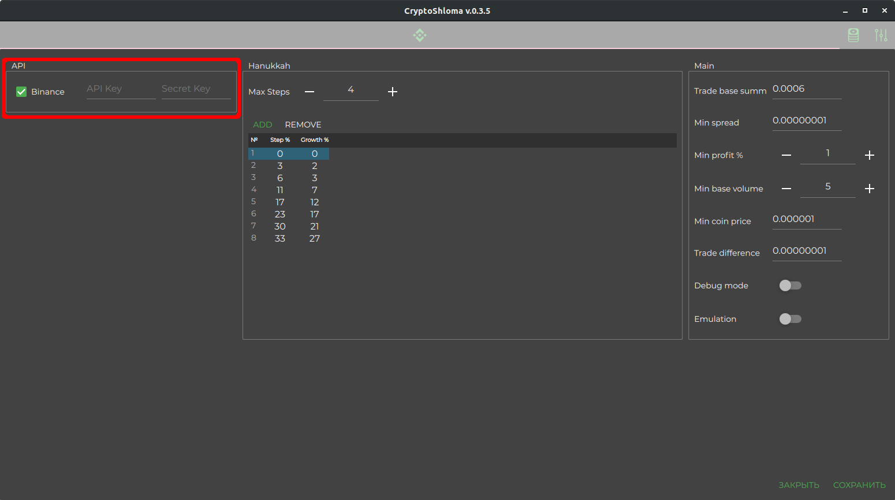

## CryptoShloma
<br>
CryptoShloma is algorithmic trading bot for Binance exchange.

Algorithmic trading based on set quantity of clever steps, when bot buys selected cryptocurrency to reduce first buy price. There are 2 tables with percent for all steps, 1st is percent of start price loss to activate step, 2nd is percent (which always lower, then 1st) of start price loss, when bot will buy crypto (it happens only when price is growing).

When cryptocurrency is growing, bot takes profit. When falls, dont loosing money. :)

* [Article on Habr.com](https://habr.com/ru/sandbox/148944)
* [Article on VC.ru](https://vc.ru/u/689296-man-k28/195465-algo-treyding-bot-cryptoshloma)

If you have a question, welcome to [Telegram](https://t.me/cryptoshloma)

## Hannukah trading algorithm

* Step 0: The position averaging table is set in advance for a certain number of steps and the maximum number of additional purchases on price rebounds.

| Drop ( % ) | Rebound (%) |
| ---------- | ----------- |
| 3          | 2           |
| 6          | 3           |
| 11         | 7           |
| 17         | 12          |
| 23         | 17          |
| 30         | 21          |
| 33         | 27          |

The first column indicates the % drawdown of the asset, the second column indicates how much % the asset should grow from the % fall, after which the asset is bought up and the position is averaged. The values are arbitrary.

* Step 1: The selected asset is purchased (long) for volume X.

* Step 2: A sell order is placed at the specified % of profit.

* Step 3: If the price went above % profit and the order was triggered, then return to step 1 and constantly re-enter.

* Step 4: If the price touches the drop value from the table (column 1), then the step with the value is fixed and then the rebound value (column 2) is expected from the % drop (column 1).

* Step 5: If the price has increased by % of the rebound for this step, then there is a purchase on the market (we get in the end on the balance X*2), and re-placing a sell order at the average price.

* Step 6: If the price has fallen below, and touched the % drop of the next step lower in the table, then go back to step 4, the bot starts working with the next pair of digits from the table, and so on, but can not go to work with the previous values.

* Step 7: If the price has passed below the % of the last drop step from the table, then alas, here you can fix a loss or leave the current sell order.

* Step 8: If there was a multiple averaging of a position on one cycle (i.e., a drop, a rebound, a drop lower by one step, then a rebound again), then each additional purchase of a position occurs for the entire previous volume of previously purchased positions * 2.

## Binance **Spot** account
To connect your account, you need to generate a public and private key in your personal account and input the keys in the bot settings. **The bot only works for your spot account.**<br>
[How to create API keys for Binance](https://www.binance.com/en/support/articles/360002502072-How-to-create-API)<br>


## Compilation depends

* [Qt 5.12.10](https://www.qt.io/download-open-source) (min Qt 5.12.8 you can setup manually in cmake file). Not recommended version above (minor) 5.12 release due to bugs in the QWebSockets (you can catch SIGFAULT). <br>You only need to install Qt 5.12.10 Prebuilt Components for Desktop in Qt MaintenenceTool, all modules are not necessary.
* OpenSSL 1.1 (installed from Qt MaintenenceTool)
* [CuteLogger](https://github.com/man-k28/CuteLogger) (forked version, build included in project)

## Platforms
* Windows 10 x64(x86)
* Debian 10 (Ubuntu 18,20)

## CMake options
```cmake
-DQt5_DIR="path to Qt cmake files" (required) - path to Qt framework
-DCuteLogget_STATIC=ON/OFF (optional, OFF default) - build library for static or shared linking
-DOPENSSL_CRYPTO_LIBRARY="path to file" (required) - path to libcrypto.so (libcrypto.dll for WIN)
-DOPENSSL_INCLUDE_DIR="path to dir" (required) - path to openssl headers
```

## Roadmap
- [x] Release Windows binary installer
- [ ] Release Linux deb installer

To be continued...
